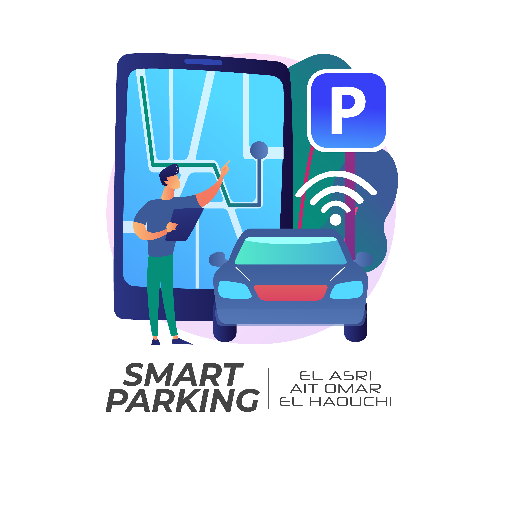

[![LinkedIn][linkedin-shield]][linkedin-url]

<!-- PROJECT LOGO -->
<br />
<p align="center">
  <a href="https://github.com/ElasriAyoub">
    
  </a>

  <h3 align="center">Smart Parking Project</h3>

  <p align="center">
   Using Image Processing and Raspberry Pi!
    <br />
    <a href="https://github.com/ElasriAyoub"><strong>Check all my projects</strong></a>
    <br />
    <br />
  </p>
</p>

<!-- ABOUT THE PROJECT -->
## About The Project
Parking spots nowadays are fundamental. The increase of vehicles and parkingsmakes it difficult for drivers to find vacant parking spaces rapidly. For a Parking company, it’s hard to supervise all of its parking manually, wasting time, energy, and patience.
In the 21st Century, time is gold. So wasting time is a meager problem to identify the spots of its parking in Real-Time.

A good reflection is to answer the questions of type **WWWHW**.

***What*** :
Application for the supervisor to supervise in Real-Time the Occupied/Vacant places
and the state of the barriers.

***Who*** :
Parking supervisors of the parking.

***When*** :
All the time.

***Why*** :
Make the supervising of the parking easy and fast.
Autonomous Parking.

***How*** :
The supervisor authenticates himself to be connected to the interface where he can see the Occupied/Vacant places and if there is a problem within the barriers.
The vehicle will be detected then Arduino will check if there is an empty place then open the barrier or maintain it close.

### Built With

This project was built using multiple tools:
* [Python](https://www.python.org//)
* [C++](https://isocpp.org/)
* [OpenCV](https://opencv.org/)
* [Arduino](https://www.arduino.cc/)

<!-- GETTING STARTED -->
## Prototyping

1. Sizing of the prototype.
2. Cut the necessary parts of the Plexiglass.
3. Gluing of the parts
4. Serial communication between the Arduino MEGA and the Raspberry Pi.

### Installation

1. Clone the repo
   ```sh
   git clone https://https://github.com/ElasriAyoub/Smart-Parking-Arduino-GUI-JAVA.git
   ```
2. Install the packages
3. Install the Arduino IDE
   -> https://www.arduino.cc/
4. Install the Pycharm IDE
   -> https://www.jetbrains.com/pycharm/
<!-- CONTRIBUTING -->


<!-- CONTACT -->
## Contact

AYOUB EL ASRI - elasri.ayoub@yahoo.com

Project Link: [https://github.com/ElasriAyoub/Smart-Parking-Raspberry-Pi-Arduino-OPENCV-PYTHON](https://github.com/ElasriAyoub/Smart-Parking-Raspberry-Pi-Arduino-OPENCV-PYTHON)

[linkedin-shield]: https://img.shields.io/badge/-LinkedIn-black.svg?style=for-the-badge&logo=linkedin&colorB=555
[linkedin-url]: https://www.linkedin.com/in/elasri-ayoub/
[product-screenshot]: Demo/Smart-Parking.png
